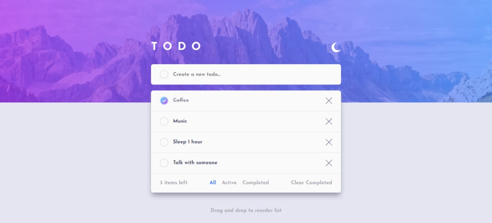
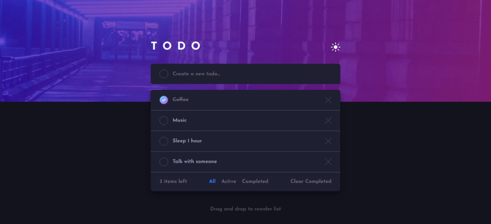
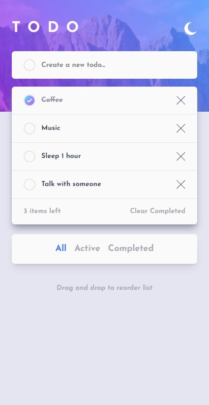
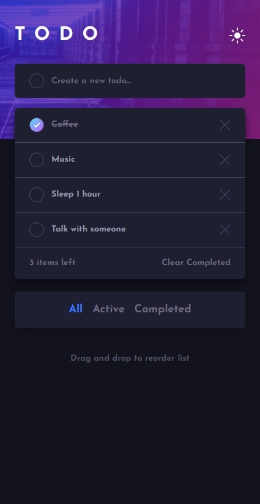

# Frontend Mentor - Todo app solution

This is a solution to the [Todo app challenge on Frontend Mentor](https://www.frontendmentor.io/challenges/todo-app-Su1_KokOW). Frontend Mentor challenges help you improve your coding skills by building realistic projects.

## Table of contents

- [Frontend Mentor - Todo app solution](#frontend-mentor---todo-app-solution)
  - [Table of contents](#table-of-contents)
  - [Overview](#overview)
    - [The challenge](#the-challenge)
    - [Screenshot](#screenshot)
    - [Links](#links)
  - [My process](#my-process)
    - [Built with](#built-with)
    - [Useful resources](#useful-resources)
  - [Author](#author)

## Overview

### The challenge

Users should be able to:

- View the optimal layout for the app depending on their device's screen size
- See hover states for all interactive elements on the page
- Add new todos to the list
- Mark todos as complete
- Delete todos from the list
- Filter by all/active/complete todos
- Clear all completed todos
- Toggle light and dark mode
- **Bonus**: Drag and drop to reorder items on the list

### Screenshot

<!--  -->

### Links

- Solution URL: [https://www.frontendmentor.io/solutions/todo-app-with-drag-n-drop-reorder-feature-slDXg1Qjd3](https://www.frontendmentor.io/solutions/todo-app-with-drag-n-drop-reorder-feature-slDXg1Qjd3)
- Live Site URL: [https://todo-app-tezarsurya.vercel.app/](https://todo-app-tezarsurya.vercel.app/)

## My process

### Built with

- Flexbox
- CSS Grid
- Mobile-first workflow
- [React](https://reactjs.org/) - A JavaScript library for building user interfaces
- [Vite](https://vitejs.dev/) - Next Generation frontend tooling
- [Tailwindcss](https://tailwindcss.com/) - Rapidly build modern websites without ever leaving your HTML.

### Useful resources

- [react-beautiful-dnd](https://www.example.comhttps://github.com/atlassian/react-beautiful-dnd) - Drag and drop library for react with easy implementation

## Author

- Frontend Mentor - [@tezarsurya](https://www.frontendmentor.io/profile/tezarsurya)
- Instagram - [@tezarsurya](https://www.instagram.com/tezarsurya)
